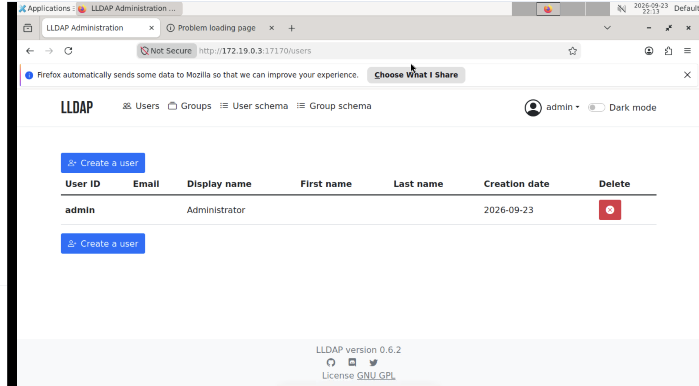
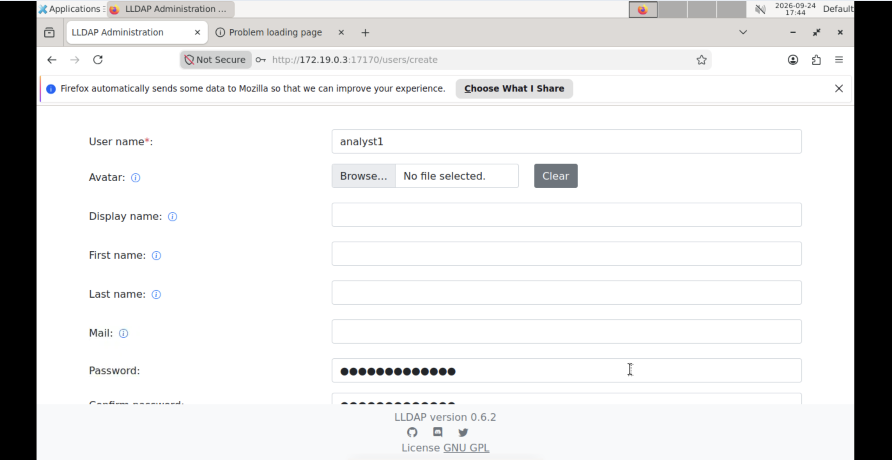
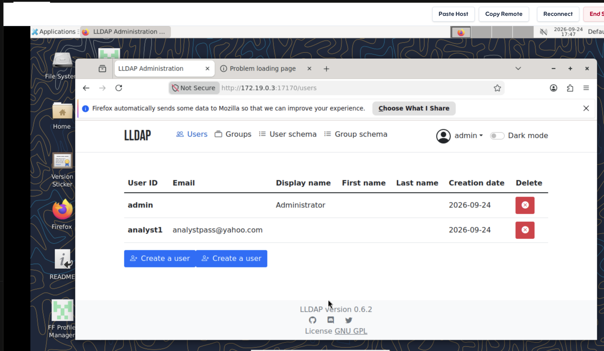
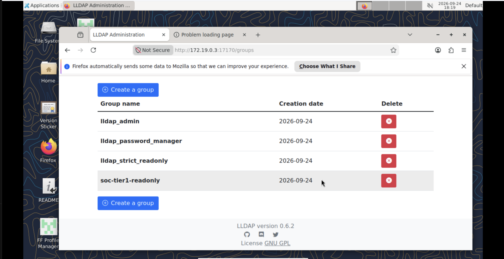
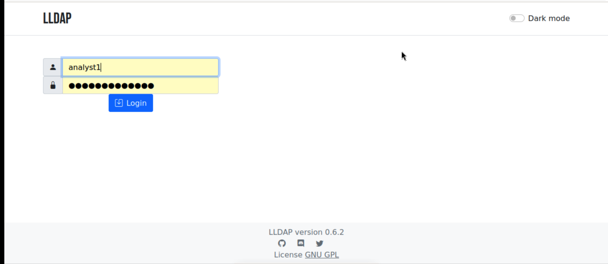
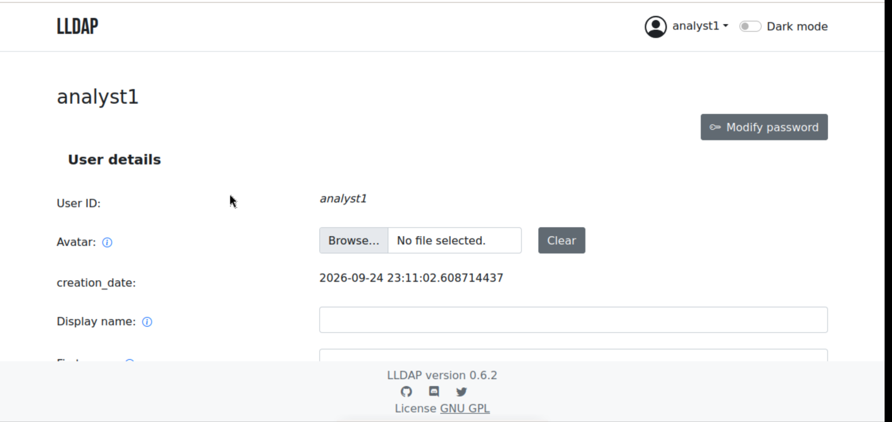
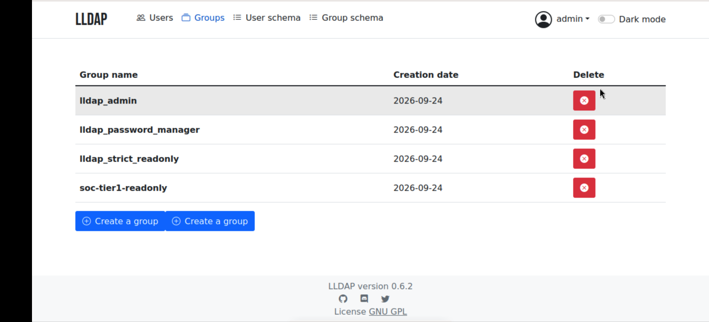

# LLDAP Least-Privilege Group Policy Lab

  

## Overview

In this lab I used **LLDAP** (Light LDAP), a lightweight identity management server, to build a least-privilege access model. I created a non-admin test user, created a read-only analyst group, assigned the user to it, and then validated that the user could not perform administrative actions.

**Goal:** Create a least-privilege group policy and verify it with a test user.

## Skills Demonstrated

- Identity and Access Management (IAM) fundamentals
- Principle of least privilege
- User and group lifecycle management in an LDAP directory
- Role-based access control (RBAC) through group membership
- Access validation and privilege auditing

## Environment

| Component | Value |
|---|---|
| Directory service | LLDAP v0.6.2 |
| Web UI endpoint | `http://<target_ip>:17170/` |
| LDAP endpoint | `<target_ip>:3890` |
| Lab target IP | `172.19.0.3` |
| Bootstrap admin | `admin` |
| Test user | `analyst1` |
| Policy group | `soc-tier1-readonly` |
| Client | Firefox on a remote Linux desktop |

**Why these endpoints matter:**

- **Web UI (17170):** the identity management interface where users, groups, and policies are configured.
- **LDAP (3890):** the port applications bind to for authentication. This lab configures policy through the web UI only.
- **Admin account:** used to create and validate the first policy model.

---

## Step 1 – Access the Target and Log In

1. Started the lab workspace and copied the live target URL from **Environment Details**.
2. Opened `http://172.19.0.3:17170/` in the desktop browser.
3. Signed in to LLDAP as `admin`.

At first login, the directory contained only the built-in `admin` account.

---

## Step 2 – Locate the UI Sections

Explored the admin navigation bar:

- **Users** – create, view, and delete accounts
- **Groups** – create and manage groups and memberships
- **User schema / Group schema** – custom attributes
- **admin ▾ menu** – profile and **Log out**

---

## Step 3 – Create the Test User

Created a non-admin identity to validate the policy. Access policies should always be tested with a non-admin account, because an admin will pass every check.

| Field | Value |
|---|---|
| Username | `analyst1` |
| Password | Lab-safe password (e.g. `Analyst1!Pass`) |

The new user appeared in the Users list next to `admin`:

---

## Step 4 – Create the Least-Privilege Group

| Field | Value |
|---|---|
| Group name | `soc-tier1-readonly` |
| Intended description | Tier 1 analysts. Read visibility only. No admin changes. |

> **Note:** LLDAP v0.6.2 does not include a group description field by default. A description can be added as a custom attribute under **Group schema** if needed.

After saving, the Groups page showed the new group alongside LLDAP's built-in groups:

### Understanding LLDAP's built-in groups

| Group | Privilege granted |
|---|---|
| `lldap_admin` | Full administrative control of the directory |
| `lldap_password_manager` | Can reset passwords of non-admin users |
| `lldap_strict_readonly` | Can read all users and groups via the UI/LDAP |
| `soc-tier1-readonly` (custom) | **No built-in LLDAP privileges** |

**Key insight:** In LLDAP, only the built-in `lldap_*` groups grant privileges inside LLDAP itself. A custom group like `soc-tier1-readonly` grants nothing on its own. Its purpose is to act as a role that downstream applications (SIEM, ticketing, VPN, etc.) can check through LDAP to decide what an analyst is allowed to do.

---

## Step 5 – Add the User to the Group

1. Opened the `analyst1` user profile.
2. Used the group membership controls to add `soc-tier1-readonly`.
3. Confirmed `analyst1` was **not** a member of `lldap_admin` (or any other `lldap_*` group).
4. Saved changes.

<!-- Optional: add a screenshot of the membership section here -->
<!--  -->

---

## Step 6 – Validate the Policy as analyst1

Logged out as `admin` and logged in as `analyst1`.

After login, `analyst1` was taken directly to their own profile page:

### Results

| Action | Result |
|---|---|
| Log in to the web UI | ✅ Allowed |
| View own user details | ✅ Allowed |
| Modify own password | ✅ Allowed |
| Access the **Users** list | ❌ Blocked – no Users menu shown |
| Access the **Groups** list | ❌ Blocked – no Groups menu shown |
| Access **User/Group schema** | ❌ Blocked – not shown |
| Create or delete users/groups | ❌ Blocked – no controls available |

**Observation:** The admin navigation bar (Users, Groups, User schema, Group schema) is completely absent for `analyst1`. Because `soc-tier1-readonly` carries no LLDAP privileges, the account behaves as a standard self-service user. All high-impact admin actions are blocked, which matches the least-privilege goal.

> If read visibility of other users and groups is required inside LLDAP, the user would also need `lldap_strict_readonly`. This is a deliberate trade-off: grant only what the role actually needs.

---

## Step 7 – Final Admin Verification

Logged out and back in as `admin` to audit memberships.

Verification checklist:

- [x] `soc-tier1-readonly` contains only the intended member (`analyst1`)
- [x] `lldap_admin` contains no unintended members
- [x] `lldap_password_manager` contains no unintended members
- [x] `lldap_strict_readonly` contains no unintended members

---

## Key Takeaways

1. **Least privilege starts at zero.** A new user in LLDAP has no admin rights until explicitly granted, which is the correct secure default.
2. **Membership drives privilege.** In LLDAP, effective permissions come entirely from group membership, so auditing privileged groups is the core access review task.
3. **Custom groups are roles, not permissions.** `soc-tier1-readonly` labels a role; connected applications enforce what that role means.
4. **Always test with a non-admin account.** Validating as `admin` would have hidden any misconfiguration.
5. **Audit after changes.** Re-checking privileged groups confirms no accidental escalation occurred.

## Security Notes

- The lab uses plain HTTP (browser shows "Not Secure") and the default `admin` / `password` credentials. In production, enable TLS (LDAPS and HTTPS), change the admin password immediately, and set strong `LLDAP_JWT_SECRET` and `LLDAP_KEY_SEED` values.
- Use test data only (e.g. `analyst1@example.com`) rather than real email addresses.

## Troubleshooting

| Issue | Fix |
|---|---|
| Page does not load | Verify the exact URL format: `http://<target_ip>:17170/` |
| Target appears then disappears | End the session and start a fresh lab |
| Desktop reconnects | Wait for a stable connection before continuing |
| Button labels differ | Use the equivalent create/edit controls in Users and Groups |

## References

- [LLDAP on GitHub](https://github.com/lldap/lldap)
- [NIST SP 800-53 AC-6: Least Privilege](https://csf.tools/reference/nist-sp-800-53/r5/ac/ac-6/)
